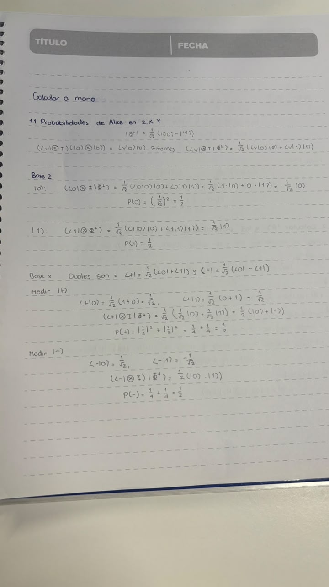
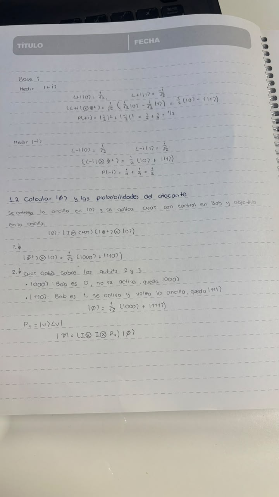
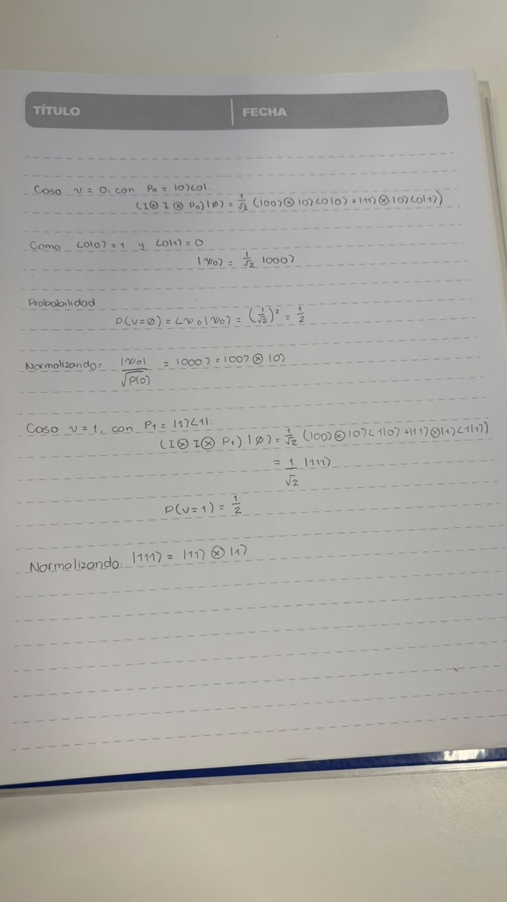
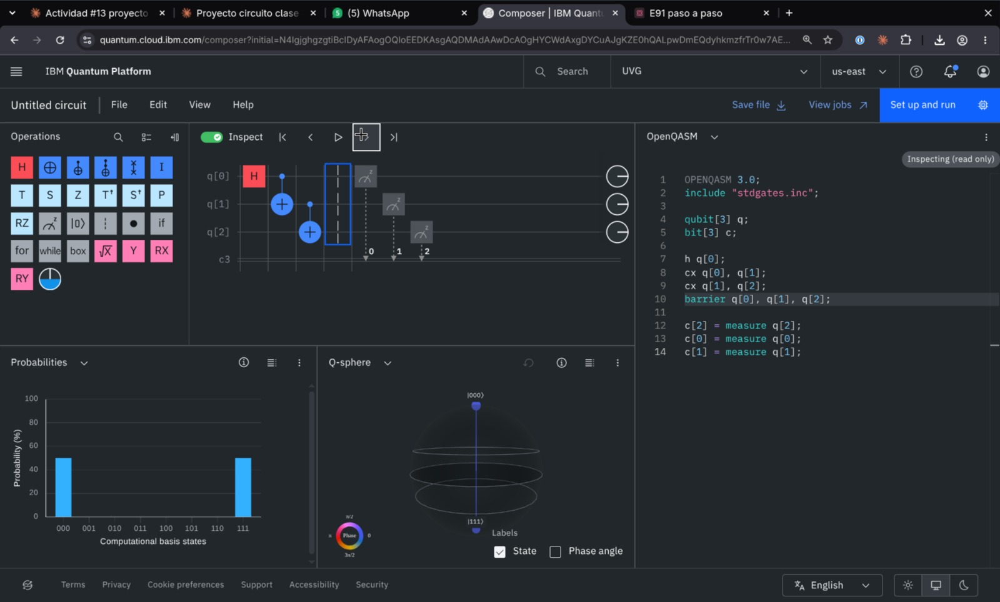
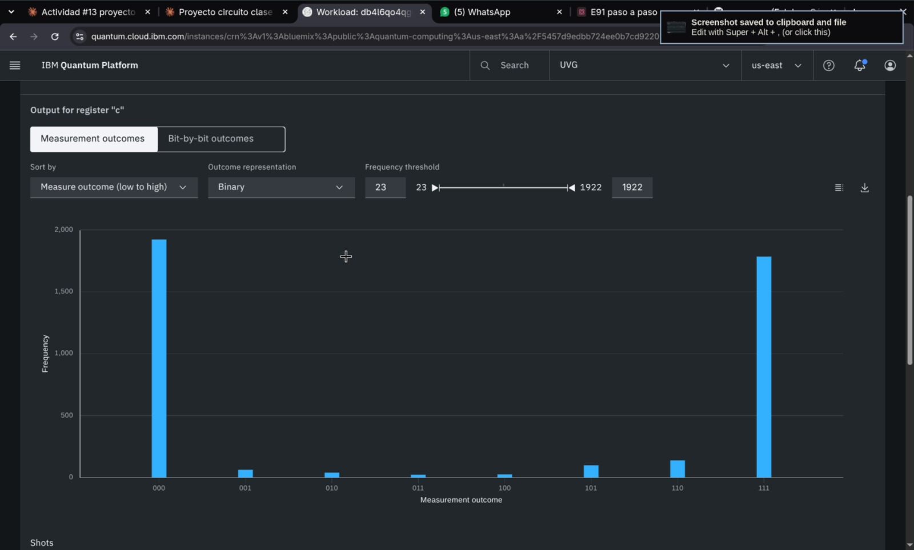
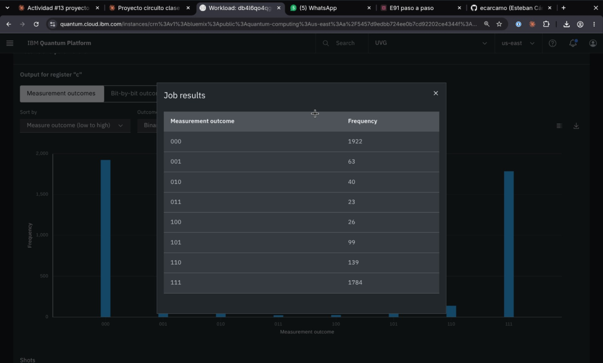

# Proyecto 1: Protocolo E91 - Eavesdropping

**CC3050 Tópicos en Computación: Computación Cuántica, UVG**
Integrantes: Esteban Cárcamo (23016) y Carlitos

Alice (qubit 1) y Bob (qubit 2) comparten $|\Phi^+\rangle$. Un atacante agrega una ancilla en $|0\rangle$, aplica un CNOT (control en Bob, objetivo en la ancilla) y mide su ancilla. Mostramos que el estado colapsa a uno **sin entrelazamiento** y cómo lo detectan Alice y Bob.

Convención: `q0` = Alice, `q1` = Bob, `q2` = Atacante. A mano los kets se escriben $|\text{Alice}\ \text{Bob}\ \text{Ancilla}\rangle$; Qiskit y el Composer imprimen los bits al revés (`c[2] c[1] c[0]` = Atacante · Bob · Alice).

## 1. Cálculos a mano

**Construcción de $|\Phi^+\rangle$:**

$$|00\rangle \xrightarrow{H\otimes I} \tfrac{1}{\sqrt2}(|00\rangle+|10\rangle) \xrightarrow{\text{CNOT}} \tfrac{1}{\sqrt2}(|00\rangle+|11\rangle) = |\Phi^+\rangle$$

**1.1 Probabilidades de Alice en Z, X, Y.** Regla: $(\langle v|\otimes I)|\Phi^+\rangle = \tfrac{1}{\sqrt2}(\langle v|0\rangle|0\rangle + \langle v|1\rangle|1\rangle)$, y la probabilidad es la norma al cuadrado del vector que queda.

| Base | Resultado | $\langle v\vert 0\rangle,\ \langle v\vert 1\rangle$ | Vector que queda | $P$ | Bob queda en |
|---|---|---|---|---|---|
| Z | $0$ | $1,\ 0$ | $\tfrac{1}{\sqrt2}\vert 0\rangle$ | ½ | $\vert 0\rangle$ |
| Z | $1$ | $0,\ 1$ | $\tfrac{1}{\sqrt2}\vert 1\rangle$ | ½ | $\vert 1\rangle$ |
| X | $+$ | $\tfrac{1}{\sqrt2},\ \tfrac{1}{\sqrt2}$ | $\tfrac12(\vert 0\rangle+\vert 1\rangle)$ | ½ | $\vert +\rangle$ |
| X | $-$ | $\tfrac{1}{\sqrt2},\ -\tfrac{1}{\sqrt2}$ | $\tfrac12(\vert 0\rangle-\vert 1\rangle)$ | ½ | $\vert -\rangle$ |
| Y | $+i$ | $\tfrac{1}{\sqrt2},\ \mathbf{-\tfrac{i}{\sqrt2}}$ | $\tfrac12(\vert 0\rangle-i\vert 1\rangle)$ | ½ | $\vert -i\rangle$ |
| Y | $-i$ | $\tfrac{1}{\sqrt2},\ \mathbf{+\tfrac{i}{\sqrt2}}$ | $\tfrac12(\vert 0\rangle+i\vert 1\rangle)$ | ½ | $\vert +i\rangle$ |

En Y el bra conjuga: $\langle +i| = \tfrac{1}{\sqrt2}(\langle 0| - i\langle 1|)$, y $|{-i/2}|^2 = (-i/2)(i/2) = \tfrac14$, así que $P(+i) = \tfrac14+\tfrac14 = \tfrac12$. En Z y X Alice y Bob coinciden; en Y salen opuestos, porque $|\Phi^+\rangle = \tfrac{1}{\sqrt2}(|{+i}\rangle|{-i}\rangle + |{-i}\rangle|{+i}\rangle)$.

**1.2 Estado después del ataque.** $|\phi\rangle = (I\otimes \text{CNOT})(|\Phi^+\rangle\otimes|0\rangle)$:

1. $|\Phi^+\rangle\otimes|0\rangle = \tfrac{1}{\sqrt2}(|000\rangle+|110\rangle)$
2. CNOT sobre Bob y ancilla: en $|000\rangle$ Bob es 0, queda $|000\rangle$; en $|110\rangle$ Bob es 1 y voltea la ancilla: $|1\rangle\otimes\text{CNOT}|10\rangle = |111\rangle$ (con matriz, $\text{CNOT}\,(0,0,1,0)^T = (0,0,0,1)^T$).

$$|\phi\rangle = \tfrac{1}{\sqrt2}(|000\rangle+|111\rangle) \quad \text{(estado GHZ)}$$

**Medición del atacante**, con $P_v = |v\rangle\langle v|$ y $|\psi_v\rangle = (I\otimes I\otimes P_v)|\phi\rangle$:

| $v$ | $\vert\psi_v\rangle$ | $P(v)$ | Normalizado |
|---|---|---|---|
| 0 | $\tfrac{1}{\sqrt2}\vert 000\rangle$ | $(\tfrac{1}{\sqrt2})^2 = \tfrac12$ | $\vert 000\rangle = \vert 0\rangle\otimes\vert 0\rangle\otimes\vert 0\rangle$ |
| 1 | $\tfrac{1}{\sqrt2}\vert 111\rangle$ | $\tfrac12$ | $\vert 111\rangle = \vert 1\rangle\otimes\vert 1\rangle\otimes\vert 1\rangle$ |

**Conclusión:** después de la medición, Alice y Bob quedan en $|00\rangle$ o $|11\rangle$, que son **estados producto**. Se perdió el entrelazamiento.

| 1.1 Bases Z y X | 1.1 Base Y y 1.2 GHZ | 1.2 Medición del atacante |
|---|---|---|
|  |  |  |

## 2. Qiskit

Notebook: [`proyecto1.ipynb`](proyecto1.ipynb) (Qiskit 2.x + `qiskit-aer`, `AerSimulator`, 4096 shots). Medir en otra base es rotar antes de medir en Z: X → `H`; Y → `Sdg` y luego `H` (manda $|{+i}\rangle$ a $|0\rangle$ y $|{-i}\rangle$ a $|1\rangle$), en la función `rotar(qc, q, base)`.

| Paso | Qué hace |
|---|---|
| 1. Bell en X, Y, Z | `bell(base)`: `H(0)`, `CX(0,1)`, rotación de ambos qubits y medición. Histogramas por base. |
| 2. GHZ + atacante | Primero el GHZ sin medir al atacante (solo `000` y `111`). Luego `ataque(base)`: `CX(1,2)`, mide la ancilla en su propio registro `atk` y después a Alice y Bob (registro `ab`) en la base. `correr_ataque` separa los conteos en $v=0$ y $v=1$. |
| 3. Comparación en Z y tasa de error | Compara Z con y sin ataque, y calcula la tasa de error por paridad esperada: Z y X par (`00`, `11`), Y impar (`01`, `10`). |

Orden de bits: en el registro `ab` la cadena es `q1 q0` (Bob · Alice), así que `'01'` significa Bob 0, Alice 1.

Resultados guardados en el notebook (los conteos cambian un poco en cada ejecución porque no hay semilla fija):

| | Z | X | Y |
|---|---|---|---|
| Bell sin ataque | `00`: 2077, `11`: 2019 | `00`: 2042, `11`: 2054 | `01`: 2041, `10`: 2055 |
| Ataque, $v=0$ | `00`: 2015 | 4 resultados, ~¼ cada uno (503 a 540) | 4 resultados, ~¼ cada uno (482 a 522) |
| Ataque, $v=1$ | `11`: 2081 | 4 resultados, ~¼ cada uno (482 a 530) | 4 resultados, ~¼ cada uno (504 a 533) |
| **Tasa de error sin → con ataque** | 0.0% → 0.0% | 0.0% → **50.2%** | 0.0% → **49.0%** |

En Z las probabilidades son iguales con y sin ataque (sin: `00` 0.507, `11` 0.493; con: `00` 0.492, `11` 0.508). El ataque solo aparece en X e Y.

## 3. Composer

Circuito enviado (el mismo que `ataque('Z')`; las mediciones al final son equivalentes porque nada toca `q[2]` después de medirlo):

```qasm
OPENQASM 3.0;
include "stdgates.inc";
qubit[3] q;
bit[3] c;
h q[0];
cx q[0], q[1];
cx q[1], q[2];
barrier q[0], q[1], q[2];
c[2] = measure q[2];
c[0] = measure q[0];
c[1] = measure q[1];
```

**Verificación con Inspect** en la barrera: Probabilities muestra `000` 50% y `111` 50%, y la Q-sphere muestra $|000\rangle$ y $|111\rangle$, el estado GHZ. Sin Inspect el panel muestra 100% `000` porque calcula el estado ya medido; no es un error.

**Envío:**

| Campo | Valor |
|---|---|
| Región | Washington DC (us-east) |
| Instancia | `actividad` (plan Open) |
| Shots | 4096 |
| QPU | `ibm_fez` (Heron r2, 156 qubits; 0 trabajos pendientes) |

**Job:**

| Campo | Valor |
|---|---|
| ID | `db4l6qo4qg6s73c2bdig` |
| Usuario | Esteban Cárcamo |
| Estado | Completed |
| Creado y completado | 9-oct-2026, 2:49 PM |
| Pending / tiempo total / uso | 1 s / 6 s / **3 s** |

| Captura | Qué muestra |
|---|---|
| [01_composer_circuito_inspect_ghz](evidencias/01_composer_circuito_inspect_ghz.jpeg) | Circuito, OpenQASM e Inspect en la barrera (`000` y `111` al 50%, Q-sphere) |
| [02_composer_setup_ibm_fez](evidencias/02_composer_setup_ibm_fez.jpeg) | "Set up and run": us-east, `actividad`, 4096 shots, `ibm_fez` |
| [03_job_detalles](evidencias/03_job_detalles.jpeg) | Detalles del job: Completed, `ibm_fez`, uso 3 s |
| [04_job_histograma](evidencias/04_job_histograma.jpeg) | Histograma de conteos |
| [05_job_shots](evidencias/05_job_shots.jpeg) | Shots 4096, argumentos y snippets de Qiskit |
| [06_job_codigo_qiskit](evidencias/06_job_codigo_qiskit.jpeg) | Snippets de Qiskit del job |
| [07_job_tabla_conteos](evidencias/07_job_tabla_conteos.jpeg) | Tabla con los 8 conteos exactos |



## 4. Resultados

Conteos del hardware (`c[2] c[1] c[0]` = Atacante · Bob · Alice; suman 4096):

| Resultado | `000` | `001` | `010` | `011` | `100` | `101` | `110` | `111` |
|---|---|---|---|---|---|---|---|---|
| Conteo | 1922 | 63 | 40 | 23 | 26 | 99 | 139 | 1784 |

| Métrica | Cálculo | Hardware | Simulador |
|---|---|---|---|
| GHZ ideal | `000` + `111` = 3706 | **90.5%** | 100% |
| Alice ≠ Bob | `001` + `010` + `101` + `110` = 341 | **8.3%** | 0% |
| Atacante = Bob | `000` + `001` + `110` + `111` = 3908 | **95.4%** | 100% |
| Alice saca 0 | `000` + `010` + `100` + `110` = 2127 | **51.9%** | 50% |

**Qué significa el ruido:** la diferencia con el simulador viene del hardware (errores del CNOT, decoherencia, errores de lectura), no del ataque. En Z el ataque no se distingue: Alice y Bob siguen coincidiendo (91.7%) y el 8.3% de discrepancia es solo ruido. Lo que delata al atacante es medir en X o Y, donde la simulación da ~50% de error, muy por encima del ~8% de ruido del hardware.




## 5. Preguntas del proyecto

**¿Por qué Alice y Bob pueden detectar el ataque?**
En Z no se nota: con y sin atacante salen `00` y `11` con ½ (la pista del enunciado: no se percibe viendo solo las probabilidades). Pero la medición del atacante deja a Alice y Bob en $|00\rangle$ o $|11\rangle$, estados producto: se rompió el entrelazamiento. Sin entrelazamiento, en X e Y sus resultados son independientes (¼ cada combinación) y la tasa de error sube de 0% a ~50% (50.2% en X y 49.0% en Y en el notebook). En E91 Alice y Bob eligen bases al azar y comparan en público una muestra; si los errores superan el ruido, hubo espía.

**1. ¿Cómo se mira el resultado de enviar al servidor de la computadora cuántica?**
El circuito entra a una cola como *job*. Al terminar se ven los detalles (QPU `ibm_fez`, uso 3 s) y un histograma de conteos por cadena `c[2]c[1]c[0]`. En hardware aparecen los 8 resultados posibles: `000` + `111` = 90.5% y el resto es ruido. Por eso Alice y Bob discrepan 8.3% aunque en teoría sería 0%.

**2. ¿Qué significan las corridas realizadas que aparecen como opción?**
Son los *shots*: cuántas veces se prepara el circuito y se mide. Cada corrida da un solo resultado (colapso) y las probabilidades se estiman como frecuencias. Por ejemplo, Alice obtuvo 0 en 2127/4096 = 51.9% ≈ ½. Más corridas dan una estimación más precisa (error $\sim 1/\sqrt{N}$).

**3. ¿El circuito para GHZ puede usar el CNOT con control en el qubit de Alice o de Bob de igual manera?**
Sí. En $|\Phi^+\rangle = \tfrac{1}{\sqrt2}(|00\rangle+|11\rangle)$ Alice y Bob tienen el mismo bit en cada término. Con control en Alice: $|000\rangle \to |000\rangle$ y $|110\rangle \to |111\rangle$, el mismo GHZ. En hardware solo podría cambiar un poco el ruido, según la conectividad física de los qubits.
